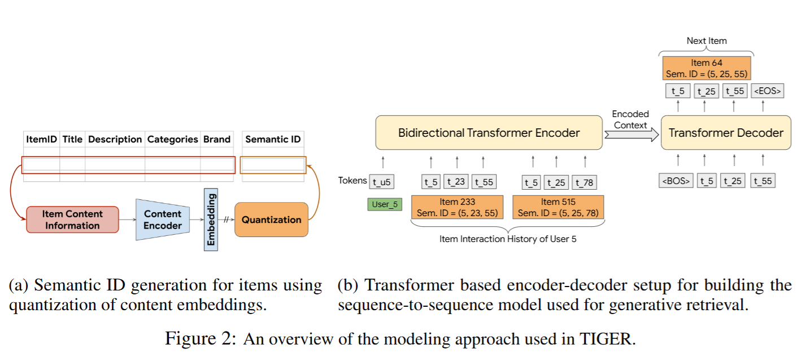

# TIGER
This is an unofficial Pytorch Implementation for the paper 

>[Recommender Systems with Generative Retrieval](https://arxiv.org/pdf/2305.05065)

# Model Architecture

# Data Preprocess

Step 1: Decompress the downloaded 5-core reviews and metadata from [Amazon Review 2014](https://cseweb.ucsd.edu/~jmcauley/datasets/amazon/links.html), which are in the format `reviews_Beauty_5.json.gz` and `meta_Beauty.json.gz`. Use the command provided in the `TIGER/data/process.ipynb` file to perform the decompression.

Step 2: Use `main.py` in `TIGER/rqvae` folder to train a rqvae model using semantic embeddings obtained in Step 1.

Step 3: Use `generate_code.py` in `TIGER/rqvae` folder to select the best model to generate discrete code for semantic embeddings in Step 1 and padding at the last position to resolve duplicate codes.

# References
[Recommender Systems with Generative Retrieval](https://arxiv.org/pdf/2305.05065)

[Adapting Large Language Models by Integrating Collaborative Semantics for Recommendation](https://ieeexplore.ieee.org/stamp/stamp.jsp?tp=&arnumber=10597986)
